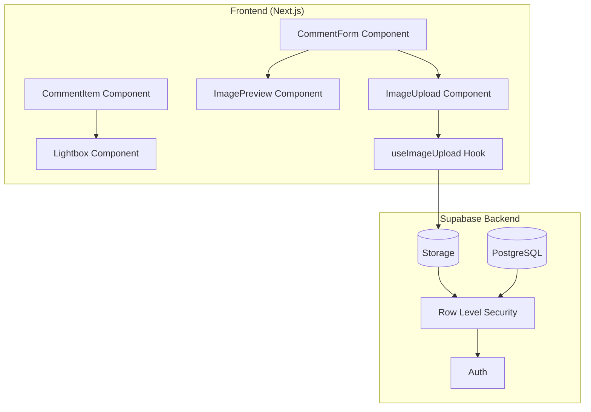

# Design Document: Comment Image Upload

## Overview

Fitur upload gambar untuk komentar di InfoBatak.id yang terintegrasi dengan sistem diskusi yang sudah ada. Menggunakan Supabase Storage untuk penyimpanan gambar dengan RLS untuk keamanan. Gambar ditampilkan inline dengan komentar dan mendukung lightbox untuk tampilan full-size.

Arsitektur mengikuti pola yang sudah ada di page-discussions, dengan penambahan komponen untuk handling file upload dan image display.

## Architecture



## Components and Interfaces

### React Components

```typescript
// ImageUpload - File input with drag-and-drop support
interface ImageUploadProps {
  onImageSelect: (file: File) => void;
  onError: (error: string) => void;
  disabled?: boolean;
}

// ImagePreview - Shows selected image before submission
interface ImagePreviewProps {
  file: File | null;
  previewUrl: string | null;
  onRemove: () => void;
  isUploading: boolean;
  uploadProgress?: number;
}

// CommentImage - Displays image in comment with lightbox trigger
interface CommentImageProps {
  imageUrl: string;
  alt?: string;
  onImageClick: () => void;
}

// Lightbox - Full-size image modal
interface LightboxProps {
  imageUrl: string;
  isOpen: boolean;
  onClose: () => void;
}
```

### Custom Hook

```typescript
// useImageUpload - Manages image upload state and operations
interface UseImageUploadReturn {
  // State
  selectedFile: File | null;
  previewUrl: string | null;
  isUploading: boolean;
  uploadProgress: number;
  error: string | null;
  
  // Actions
  selectImage: (file: File) => void;
  removeImage: () => void;
  uploadImage: () => Promise<string | null>; // Returns URL or null on error
  resetState: () => void;
}

// Validation result
interface ImageValidationResult {
  valid: boolean;
  error?: 'INVALID_TYPE' | 'FILE_TOO_LARGE' | 'NO_FILE';
}
```

## Data Models

### Database Schema Changes

```sql
-- Add image_url column to existing comments table
ALTER TABLE comments 
ADD COLUMN image_url TEXT DEFAULT NULL;

-- Index for queries that filter by image presence
CREATE INDEX idx_comments_image_url ON comments(image_url) WHERE image_url IS NOT NULL;
```

### Supabase Storage Setup

```sql
-- Create storage bucket for comment images
INSERT INTO storage.buckets (id, name, public)
VALUES ('comment-images', 'comment-images', true);

-- Storage RLS: Only authenticated users can upload
CREATE POLICY "Authenticated users can upload images"
ON storage.objects FOR INSERT
WITH CHECK (
  bucket_id = 'comment-images' 
  AND auth.role() = 'authenticated'
);

-- Storage RLS: Anyone can view images (public bucket)
CREATE POLICY "Anyone can view comment images"
ON storage.objects FOR SELECT
USING (bucket_id = 'comment-images');

-- Storage RLS: Users can delete their own images
CREATE POLICY "Users can delete own images"
ON storage.objects FOR DELETE
USING (
  bucket_id = 'comment-images'
  AND (storage.foldername(name))[1] = auth.uid()::text
);
```

### TypeScript Types

```typescript
// Extended Comment type with image
interface CommentWithImage extends Comment {
  image_url: string | null;
}

// Image validation constants
const ALLOWED_IMAGE_TYPES = ['image/jpeg', 'image/png', 'image/gif', 'image/webp'] as const;
const MAX_FILE_SIZE = 5 * 1024 * 1024; // 5MB in bytes

type AllowedImageType = typeof ALLOWED_IMAGE_TYPES[number];

// Upload result
interface ImageUploadResult {
  url: string | null;
  error: 'AUTH_REQUIRED' | 'UPLOAD_FAILED' | 'VALIDATION_ERROR' | null;
}

// Error messages in Indonesian
const imageErrorMessages = {
  INVALID_TYPE: 'Format file tidak didukung. Gunakan JPEG, PNG, GIF, atau WebP.',
  FILE_TOO_LARGE: 'Ukuran file terlalu besar. Maksimal 5MB.',
  NO_FILE: 'Tidak ada file yang dipilih.',
  AUTH_REQUIRED: 'Silakan login untuk mengupload gambar.',
  UPLOAD_FAILED: 'Gagal mengupload gambar. Silakan coba lagi.',
} as const;
```

## Correctness Properties

*A property is a characteristic or behavior that should hold true across all valid executions of a system—essentially, a formal statement about what the system should do. Properties serve as the bridge between human-readable specifications and machine-verifiable correctness guarantees.*

### Property 1: File Type Validation

*For any* file with a MIME type, the validation function SHALL return valid=true only if the MIME type is one of: image/jpeg, image/png, image/gif, or image/webp.

**Validates: Requirements 1.2**

### Property 2: File Size Validation

*For any* file, the validation function SHALL return valid=true only if the file size is less than or equal to 5MB (5,242,880 bytes).

**Validates: Requirements 1.3**

### Property 3: Upload Round-Trip

*For any* valid image file uploaded by an authenticated user, the returned URL SHALL be accessible and the image retrievable.

**Validates: Requirements 1.7**

### Property 4: Unique Filename Generation

*For any* two calls to the filename generator, the generated filenames SHALL be unique (no collisions).

**Validates: Requirements 4.2**

### Property 5: Storage Path Structure

*For any* generated storage path, it SHALL follow the pattern `{user_id}/{uuid}.{extension}` where user_id is a valid UUID, uuid is a valid UUID, and extension matches the original file extension.

**Validates: Requirements 4.5**

### Property 6: Preview State Management

*For any* image selection followed by removal, the preview state SHALL return to null/empty state.

**Validates: Requirements 3.2**

### Property 7: Cascade Delete Storage

*For any* comment with an image that is deleted, the associated image file in storage SHALL also be deleted.

**Validates: Requirements 3.3**

## Error Handling

### Error Types and Messages

```typescript
type ImageUploadError = 
  | 'INVALID_TYPE'      // File type not allowed
  | 'FILE_TOO_LARGE'    // File exceeds 5MB
  | 'NO_FILE'           // No file selected
  | 'AUTH_REQUIRED'     // User not logged in
  | 'UPLOAD_FAILED'     // Storage upload error
  | 'DELETE_FAILED';    // Storage delete error

const imageErrorMessages: Record<ImageUploadError, string> = {
  INVALID_TYPE: 'Format file tidak didukung. Gunakan JPEG, PNG, GIF, atau WebP.',
  FILE_TOO_LARGE: 'Ukuran file terlalu besar. Maksimal 5MB.',
  NO_FILE: 'Tidak ada file yang dipilih.',
  AUTH_REQUIRED: 'Silakan login untuk mengupload gambar.',
  UPLOAD_FAILED: 'Gagal mengupload gambar. Silakan coba lagi.',
  DELETE_FAILED: 'Gagal menghapus gambar.',
};
```

### Error Handling Strategy

1. **Client-side Validation**: Validate file type and size before upload attempt
2. **Preview Cleanup**: Revoke object URLs when component unmounts or image removed
3. **Upload Retry**: Allow retry on network failures
4. **Graceful Degradation**: If image fails to load, show placeholder
5. **Toast Notifications**: Show error messages using existing toast component

## Testing Strategy

### Unit Tests

Unit tests focus on specific examples and edge cases:

- File type validation for each allowed type (JPEG, PNG, GIF, WebP)
- File type rejection for disallowed types (PDF, SVG, BMP)
- File size boundary tests (4.9MB pass, 5MB pass, 5.1MB fail)
- Error message mapping for each error type
- Preview state transitions (select → preview → remove → empty)

### Property-Based Tests

Property-based tests verify universal properties using fast-check library:

- **Minimum 100 iterations per property test**
- Each test tagged with: **Feature: comment-image-upload, Property {N}: {description}**

Testing framework: Vitest with fast-check for property-based testing.

```typescript
// Example property test structure
import { fc } from 'fast-check';
import { validateImageFile, generateStoragePath } from '@/lib/image-upload';

describe('Image Upload Properties', () => {
  // Property 1: File Type Validation
  it('should only accept allowed image types', () => {
    const allowedTypes = ['image/jpeg', 'image/png', 'image/gif', 'image/webp'];
    
    fc.assert(
      fc.property(
        fc.oneof(
          fc.constantFrom(...allowedTypes),
          fc.string().filter(s => !allowedTypes.includes(s))
        ),
        (mimeType) => {
          const result = validateImageFile({ type: mimeType, size: 1000 } as File);
          if (allowedTypes.includes(mimeType)) {
            return result.valid === true;
          } else {
            return result.valid === false && result.error === 'INVALID_TYPE';
          }
        }
      ),
      { numRuns: 100 }
    );
  });

  // Property 4: Unique Filename Generation
  it('should generate unique filenames', () => {
    fc.assert(
      fc.property(
        fc.integer({ min: 2, max: 100 }),
        (count) => {
          const filenames = new Set<string>();
          for (let i = 0; i < count; i++) {
            filenames.add(generateStoragePath('user-123', 'jpg'));
          }
          return filenames.size === count;
        }
      ),
      { numRuns: 100 }
    );
  });
});
```

### Integration Tests

- Supabase Storage upload/download cycle
- RLS policy verification (auth required for upload)
- Comment deletion with image cleanup
- Full flow: select → preview → upload → display → delete

