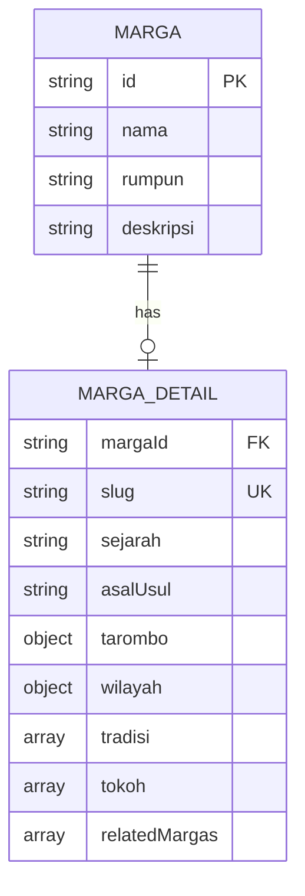

# Design Document: Marga Detail Pages

## Overview

Fitur ini menambahkan halaman detail untuk setiap marga Batak. Ketika pengguna mengklik card marga di halaman `/marga`, mereka akan diarahkan ke halaman detail `/marga/[slug]` yang berisi informasi lengkap tentang marga tersebut. Data disimpan dalam file JSON terpisah dengan struktur yang siap untuk future dynamic editing.

## Architecture

### Page Structure

```
/marga                      → Halaman utama dengan daftar semua marga (existing)
/marga/[slug]               → Halaman detail untuk setiap marga (new)
  ├── /marga/sitorus
  ├── /marga/siahaan
  ├── /marga/ginting
  └── ... (30+ marga routes)
```

### Data Flow

```mermaid
graph TD
    A[marga.json] --> B[lib/data.ts]
    C[marga-detail.json] --> B
    B --> D[getAllMarga]
    B --> E[getMargaBySlug]
    B --> F[getMargaDetailBySlug]
    D --> G[/marga page]
    E --> H[/marga/slug page]
    F --> H
    G --> I[MargaCard Component]
    H --> J[MargaDetail Sections]
```

### Data Relationship



## Components and Interfaces

### Updated MargaCard (Existing Component Update)

Update card di halaman `/marga` untuk menjadi clickable dengan Link ke detail page.

```typescript
// Wrap existing card with Link
<Link href={`/marga/${marga.slug}`}>
  <motion.div className="...existing card styles...">
    {/* existing card content */}
  </motion.div>
</Link>
```

### MargaDetailPage Layout

Halaman detail dengan sections yang render berdasarkan data availability.

Sections:
1. Hero section dengan nama marga dan rumpun badge
2. Sejarah section (if sejarah exists)
3. Asal Usul section (if asalUsul exists)
4. Tarombo section dengan genealogy visualization (if tarombo exists)
5. Wilayah section dengan map (if wilayah exists)
6. Tradisi section (if tradisi exists)
7. Tokoh Terkenal section (if tokoh exists)
8. Related Margas section (if relatedMargas exists)
9. Back navigation to /marga

### MapComponent

Komponen untuk menampilkan lokasi wilayah asal marga.

```typescript
interface MapProps {
  latitude: number;
  longitude: number;
  label: string;
  zoom?: number;
}
```

Options for implementation:
- Static map image from OpenStreetMap/Google Static Maps
- Embedded iframe from Google Maps
- Leaflet.js for interactive map (recommended for future)

For MVP: Use static map image or Google Maps embed.

## Data Models

### Extended Marga Type (Update existing)

```typescript
// types/index.ts - Update existing Marga interface
interface Marga {
  id: string;
  nama: string;
  rumpun: Rumpun;
  deskripsi?: string;
  slug: string;  // NEW: URL-friendly identifier
}
```

### MargaDetail Type (New)

```typescript
interface MargaDetail {
  margaId: string;           // Reference to Marga.id
  slug: string;              // URL-friendly, matches Marga.slug
  sejarah?: string;          // History of the marga
  asalUsul?: string;         // Origin story
  tarombo?: Tarombo;         // Genealogy structure
  wilayah?: Wilayah;         // Region of origin
  tradisi?: string[];        // Traditions specific to marga
  tokoh?: TokohMarga[];      // Famous figures
  relatedMargas?: string[];  // Array of related marga slugs
  updatedAt?: string;        // For future CRUD tracking
}

interface Tarombo {
  description: string;
  ancestors?: Ancestor[];
  subMargas?: SubMarga[];
}

interface Ancestor {
  nama: string;
  gelar?: string;
  deskripsi?: string;
}

interface SubMarga {
  nama: string;
  deskripsi?: string;
}

interface Wilayah {
  nama: string;
  deskripsi: string;
  latitude: number;
  longitude: number;
  provinsi?: string;
  kabupaten?: string;
}

interface TokohMarga {
  nama: string;
  gelar?: string;
  bidang?: string;
  deskripsi: string;
}
```

### Data File Structure

File: `content/data/marga-detail.json`

```json
[
  {
    "margaId": "1",
    "slug": "sitorus",
    "sejarah": "Marga Sitorus adalah salah satu marga besar...",
    "asalUsul": "Menurut tradisi lisan, marga Sitorus berasal dari...",
    "tarombo": {
      "description": "Silsilah marga Sitorus bermula dari...",
      "ancestors": [
        {
          "nama": "Ompu Sitorus",
          "gelar": "Raja Sitorus",
          "deskripsi": "Leluhur pertama marga Sitorus"
        }
      ],
      "subMargas": [
        {
          "nama": "Sitorus Pane",
          "deskripsi": "Cabang dari Sitorus yang bermukim di Pane"
        }
      ]
    },
    "wilayah": {
      "nama": "Tapanuli Utara",
      "deskripsi": "Wilayah asal marga Sitorus berada di sekitar...",
      "latitude": 2.3333,
      "longitude": 99.0667,
      "provinsi": "Sumatera Utara",
      "kabupaten": "Tapanuli Utara"
    },
    "tradisi": [
      "Upacara adat khusus marga Sitorus",
      "Tradisi pernikahan khas"
    ],
    "tokoh": [
      {
        "nama": "Dr. T.B. Simatupang",
        "gelar": "Jenderal TNI",
        "bidang": "Militer",
        "deskripsi": "Tokoh militer dan intelektual Indonesia"
      }
    ],
    "relatedMargas": ["siahaan", "simbolon"],
    "updatedAt": "2025-01-10"
  }
]
```

### Data Access Functions

```typescript
// lib/data.ts additions

// Get marga with slug (update existing function or add new)
export function getMargaBySlug(slug: string): Marga | undefined

// Get marga detail by slug
export function getMargaDetailBySlug(slug: string): MargaDetail | undefined

// Get combined marga + detail data
export function getFullMargaBySlug(slug: string): (Marga & MargaDetail) | undefined

// Get all marga slugs for static generation
export function getAllMargaSlugs(): string[]
```

## Correctness Properties

*A property is a characteristic or behavior that should hold true across all valid executions of a system-essentially, a formal statement about what the system should do. Properties serve as the bridge between human-readable specifications and machine-verifiable correctness guarantees.*

### Property 1: Navigation from Card to Detail

*For any* marga card clicked, the navigation SHALL route to `/marga/{slug}` where slug matches the marga's slug property.

**Validates: Requirements 1.1**

### Property 2: Basic Info Rendering Completeness

*For any* marga detail page, the rendered page SHALL contain the marga name as title, the rumpun badge, a hero section, and a back navigation link to `/marga`.

**Validates: Requirements 2.1, 2.2, 2.3, 2.4**

### Property 3: Conditional Section Rendering

*For any* marga detail data, if a section's data exists (sejarah, asalUsul, tarombo, wilayah, tradisi, tokoh, relatedMargas), the corresponding section SHALL be rendered; if the data is missing, the section SHALL NOT be rendered and no error SHALL occur.

**Validates: Requirements 3.1, 3.2, 4.1, 4.2, 4.3, 5.1, 5.2, 5.4, 6.1, 6.2, 6.3, 7.4**

### Property 4: Data Schema Validity

*For any* marga detail object in marga-detail.json, it SHALL contain margaId and slug fields, and the margaId SHALL reference a valid id in marga.json.

**Validates: Requirements 7.2, 7.6**

## Error Handling

### Invalid Route Handling

- Jika user mengakses `/marga/[invalid-slug]`, sistem akan menampilkan halaman 404
- Implementasi menggunakan Next.js `notFound()` function

### Missing Detail Data

- Jika marga ada di marga.json tapi tidak ada di marga-detail.json, tampilkan halaman dengan info dasar saja
- Graceful degradation: hanya render sections yang datanya tersedia

### Map Loading Errors

- Jika map gagal load, tampilkan fallback dengan text description saja
- Log error untuk debugging

## Testing Strategy

### Unit Tests

Unit tests akan fokus pada:
- Data access functions (`getMargaBySlug`, `getMargaDetailBySlug`, `getFullMargaBySlug`)
- Component rendering dengan berbagai props
- Edge cases (missing data, partial data)

### Property-Based Tests

Property-based tests menggunakan `fast-check` library untuk:
- Validasi schema data marga detail
- Validasi conditional rendering logic
- Validasi navigation URL generation

Konfigurasi:
- Minimum 100 iterations per property test
- Tag format: **Feature: marga-detail-pages, Property {number}: {property_text}**

### Integration Tests

- Route navigation testing
- Page rendering dengan real data
- 404 handling untuk invalid routes
- Partial data rendering

