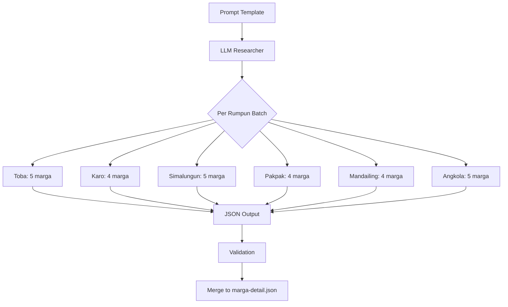

# Design Document: Marga Research Plan

## Overview

Dokumen ini berisi design lengkap untuk research plan pengisian data 27 marga Batak. Tujuan utama adalah menyediakan prompt template yang dapat digunakan oleh LLM lain untuk melakukan research dan menghasilkan data marga yang akurat secara budaya dan sesuai dengan schema yang sudah ada.

## Architecture

### Research Flow



### Batch Structure

| Batch | Rumpun     | Marga Count | Marga List                                       |
| ----- | ---------- | ----------- | ------------------------------------------------ |
| 1     | Toba       | 5           | Siahaan, Simbolon, Sinaga, Hutabarat, Napitupulu |
| 2     | Karo       | 4           | Sembiring, Tarigan, Karo-Karo, Perangin-angin    |
| 3     | Simalungun | 5           | Saragih, Purba, Sinaga, Damanik, Simatupang      |
| 4     | Pakpak     | 4           | Tumanggor, Manik, Banurea, Bancin                |
| 5     | Mandailing | 4           | Lubis, Rangkuti, Daulay, Hasibuan                |
| 6     | Angkola    | 5           | Harahap, Siregar, Rambe, Batubara, Pohan         |

## Components and Interfaces

### Master Prompt Template

Template ini akan digunakan untuk setiap batch research:

````markdown
# Research Task: Data Detail Marga Batak

## Konteks

Anda adalah peneliti budaya Batak yang bertugas mengisi data detail marga untuk website InfoBatak.id. Website ini bertujuan melestarikan dan mengedukasi tentang sejarah, budaya, adat istiadat, aksara, dan sistem marga Batak.

## Tugas

Lakukan research mendalam untuk marga-marga berikut dari rumpun [NAMA_RUMPUN]:
[DAFTAR_MARGA]

## Schema JSON yang HARUS Diikuti

Setiap marga HARUS menghasilkan object JSON dengan struktur berikut:

```json
{
  "margaId": "[ID dari marga.json]",
  "slug": "[slug dari marga.json]",
  "sejarah": "[Paragraf 2-3 kalimat tentang sejarah marga]",
  "asalUsul": "[Paragraf 2-3 kalimat tentang asal usul dan penamaan marga]",
  "tarombo": {
    "description": "[Deskripsi singkat tentang tarombo/silsilah marga]",
    "ancestors": [
      {
        "nama": "[Nama leluhur]",
        "gelar": "[Gelar jika ada, optional]",
        "deskripsi": "[Deskripsi singkat tentang leluhur]"
      }
    ],
    "subMargas": [
      {
        "nama": "[Nama sub-marga/cabang]",
        "deskripsi": "[Deskripsi singkat tentang sub-marga]"
      }
    ]
  },
  "wilayah": {
    "nama": "[Nama wilayah asal]",
    "deskripsi": "[Deskripsi tentang wilayah dan karakteristiknya]",
    "latitude": [koordinat latitude],
    "longitude": [koordinat longitude],
    "provinsi": "Sumatera Utara",
    "kabupaten": "[Nama kabupaten]"
  },
  "tradisi": [
    "[Tradisi/ritual khas marga 1]",
    "[Tradisi/ritual khas marga 2]"
  ],
  "tokoh": [
    {
      "nama": "[Nama tokoh]",
      "gelar": "[Gelar/jabatan]",
      "bidang": "[Bidang: Adat/Militer/Politik/Pendidikan/Seni/dll]",
      "deskripsi": "[Deskripsi singkat tentang tokoh]"
    }
  ],
  "relatedMargas": ["[slug marga terkait 1]", "[slug marga terkait 2]"],
  "updatedAt": "[YYYY-MM-DD]"
}
```
````

## Referensi Data Marga (dari marga.json)

[TABEL_REFERENSI_MARGA]

## Contoh Output yang Benar

Berikut contoh data marga yang sudah ada sebagai referensi kualitas dan format:

### Contoh 1: Sitorus (Toba)

```json
{
  "margaId": "1",
  "slug": "sitorus",
  "sejarah": "Marga Sitorus dikenal sebagai salah satu marga tua di Balige dan daerah sekitar Danau Toba. Tradisi lisan menyebutkan perannya dalam membuka huta-huta baru serta menjaga hubungan Dalihan Na Tolu.",
  "asalUsul": "Asal usul Sitorus ditelusuri ke keturunan Guru Tatea Bulan yang menetap di pesisir Danau Toba. Penamaan Sitorus merujuk pada leluhur yang dikenal tangguh dan dekat dengan alam danau.",
  "tarombo": {
    "description": "Tarombo Sitorus menegaskan garis keturunan patrilineal yang menjaga keterhubungan antar dongan tubu dan boru.",
    "ancestors": [
      {
        "nama": "Ompu Raja Sitorus",
        "gelar": "Raja Sitorus",
        "deskripsi": "Leluhur yang menjadi rujukan utama tarombo Sitorus di Balige."
      },
      {
        "nama": "Guru Tatea Bulan",
        "deskripsi": "Figur besar dalam tarombo Batak yang menurunkan berbagai marga termasuk Sitorus."
      }
    ],
    "subMargas": [
      {
        "nama": "Sitorus Pane",
        "deskripsi": "Cabang yang banyak bermukim di sekitar Balige dan Porsea."
      },
      {
        "nama": "Sitorus Lumban Siantar",
        "deskripsi": "Cabang yang berkembang di wilayah Silindung."
      }
    ]
  },
  "wilayah": {
    "nama": "Balige, Toba",
    "deskripsi": "Wilayah asal Sitorus berada di tepian Danau Toba dengan budaya maritim dan pertanian yang kuat.",
    "latitude": 2.334,
    "longitude": 99.066,
    "provinsi": "Sumatera Utara",
    "kabupaten": "Toba"
  },
  "tradisi": [
    "Horja adat Sitorus untuk merayakan pencapaian keluarga besar",
    "Penggunaan ulos khas dalam upacara mangulosi generasi baru"
  ],
  "tokoh": [
    {
      "nama": "Ompu Sitorus Parhusip",
      "gelar": "Pemuka Adat",
      "bidang": "Adat",
      "deskripsi": "Tokoh adat yang dikenal menjaga arsip tarombo dan memimpin horja Sitorus."
    }
  ],
  "relatedMargas": ["siahaan", "simbolon"],
  "updatedAt": "2024-01-15"
}
```

### Contoh 2: Ginting (Karo)

```json
{
  "margaId": "7",
  "slug": "ginting",
  "sejarah": "Marga Ginting adalah bagian dari Merga Silima dalam budaya Karo dan memiliki peran penting dalam struktur pemerintahan adat di Tanah Karo.",
  "asalUsul": "Nama Ginting diyakini berasal dari leluhur yang menetap di wilayah Kabanjahe dan sekitarnya. Garis keturunan dijaga ketat melalui aturan perkawinan Merga Silima.",
  "tarombo": {
    "description": "Tarombo Ginting menempatkan leluhur sebagai penjaga adat dan penyebar nilai gotong royong di dataran tinggi Karo.",
    "ancestors": [
      {
        "nama": "Guru Kinayan",
        "deskripsi": "Leluhur yang menjadi rujukan beberapa cabang marga Ginting."
      },
      {
        "nama": "Sembiring Pelawi",
        "deskripsi": "Tokoh yang menjaga hubungan antar merga di Tanah Karo."
      }
    ],
    "subMargas": [
      {
        "nama": "Ginting Mergana",
        "deskripsi": "Sub-marga yang banyak ditemukan di wilayah Kabanjahe."
      },
      {
        "nama": "Ginting Suka",
        "deskripsi": "Cabang yang dikenal sebagai penjaga lahan ladang di perbukitan."
      }
    ]
  },
  "wilayah": {
    "nama": "Kabanjahe, Tanah Karo",
    "deskripsi": "Berada di dataran tinggi Karo dengan tradisi ladang dan kebun yang kuat serta kedekatan dengan Gunung Sinabung.",
    "latitude": 3.1034,
    "longitude": 98.4891,
    "provinsi": "Sumatera Utara",
    "kabupaten": "Karo"
  },
  "tradisi": [
    "Erpangir ku lau sebagai ritual pembersihan diri dan kampung",
    "Perkulunen untuk mengatur tata cara pesta adat Ginting"
  ],
  "tokoh": [
    {
      "nama": "Djamin Ginting",
      "gelar": "Letjen TNI",
      "bidang": "Militer",
      "deskripsi": "Pahlawan nasional dari Tanah Karo yang dikenal memperjuangkan kemerdekaan."
    }
  ],
  "relatedMargas": ["tarigan", "karo-karo"],
  "updatedAt": "2024-02-20"
}
```

## Panduan Kualitas Konten

### WAJIB:

1. Gunakan terminologi Batak yang benar dengan penjelasan dalam Bahasa Indonesia
2. Minimal 2 ancestors dalam tarombo
3. Minimal 2 sub-marga dalam tarombo (jika ada informasi)
4. Minimal 2 tradisi khas marga
5. Minimal 1 tokoh (historis atau kontemporer)
6. Koordinat wilayah yang akurat
7. relatedMargas harus menggunakan slug yang valid dari marga.json

### HINDARI:

1. Jangan fabrikasi informasi jika tidak yakin
2. Jangan copy-paste dari marga lain
3. Jangan gunakan placeholder seperti "[TBD]" atau "[Unknown]"
4. Jangan campur informasi antar rumpun

### JIKA INFORMASI TIDAK TERSEDIA:

- Untuk ancestors: gunakan "Ompu [Nama Marga]" sebagai leluhur generik
- Untuk tokoh: cari tokoh kontemporer dari marga tersebut
- Untuk tradisi: gunakan tradisi umum rumpun yang relevan
- Tandai dengan catatan jika informasi perlu verifikasi lebih lanjut

## Output Format

Hasilkan output dalam format JSON array yang valid:

```json
[
  { /* marga 1 */ },
  { /* marga 2 */ },
  ...
]
```

````

## Data Models

### MargaDetail Interface

```typescript
interface MargaDetail {
  margaId: string;
  slug: string;
  sejarah: string;
  asalUsul: string;
  tarombo: Tarombo;
  wilayah: Wilayah;
  tradisi: string[];
  tokoh: Tokoh[];
  relatedMargas: string[];
  updatedAt: string;
}

interface Tarombo {
  description: string;
  ancestors: Ancestor[];
  subMargas: SubMarga[];
}

interface Ancestor {
  nama: string;
  gelar?: string;
  deskripsi: string;
}

interface SubMarga {
  nama: string;
  deskripsi: string;
}

interface Wilayah {
  nama: string;
  deskripsi: string;
  latitude: number;
  longitude: number;
  provinsi: string;
  kabupaten: string;
}

interface Tokoh {
  nama: string;
  gelar: string;
  bidang: string;
  deskripsi: string;
}
````

## Correctness Properties

_A property is a characteristic or behavior that should hold true across all valid executions of a system-essentially, a formal statement about what the system should do. Properties serve as the bridge between human-readable specifications and machine-verifiable correctness guarantees._

### Property 1: Schema Validation

_For any_ generated marga detail object, it SHALL contain all required fields: margaId, slug, sejarah, asalUsul, tarombo (with description, ancestors, subMargas), wilayah (with nama, deskripsi, latitude, longitude, provinsi, kabupaten), tradisi, tokoh, relatedMargas, and updatedAt.

**Validates: Requirements 2.1, 2.2, 2.3, 2.4, 2.5**

### Property 2: Minimum Content Requirements

_For any_ generated marga detail object:

- tarombo.ancestors array SHALL have length >= 2
- tarombo.subMargas array SHALL have length >= 2
- tradisi array SHALL have length >= 2
- tokoh array SHALL have length >= 1

**Validates: Requirements 4.4, 4.5, 4.6, 4.7**

### Property 3: Related Margas Validity

_For any_ generated marga detail object, all items in relatedMargas array SHALL be valid slugs that exist in marga.json.

**Validates: Requirements 2.1**

## Error Handling

### Validation Errors

| Error Type                            | Handling                            |
| ------------------------------------- | ----------------------------------- |
| Missing required field                | Reject output, request regeneration |
| Invalid JSON format                   | Reject output, request regeneration |
| Invalid relatedMargas slug            | Flag for manual review              |
| Insufficient content (below minimums) | Flag for enhancement                |

### Research Gaps

Jika LLM tidak dapat menemukan informasi yang cukup:

1. Gunakan informasi umum rumpun sebagai fallback
2. Tandai field dengan catatan "[Perlu verifikasi]" di deskripsi
3. Jangan biarkan field kosong atau null

## Testing Strategy

### Validation Script

Setelah setiap batch, jalankan validasi:

1. **JSON Schema Validation**: Pastikan semua field required ada
2. **Content Length Validation**: Pastikan minimum content terpenuhi
3. **Cross-Reference Validation**: Pastikan relatedMargas valid
4. **Duplicate Check**: Pastikan tidak ada duplikasi margaId atau slug

### Manual Review Checklist

- [ ] Terminologi Batak digunakan dengan benar
- [ ] Tidak ada informasi yang tercampur antar rumpun
- [ ] Koordinat wilayah masuk akal
- [ ] Tokoh yang disebutkan dapat diverifikasi
- [ ] Tradisi relevan dengan rumpun marga
