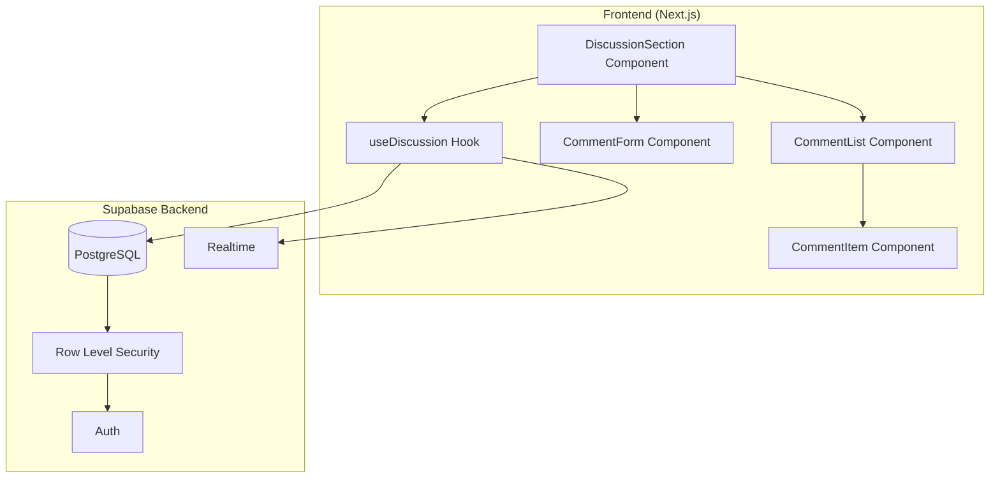

# Design Document: Page Discussions

## Overview

Fitur diskusi per halaman untuk InfoBatak.id yang memungkinkan pengguna berdiskusi di setiap halaman konten. Sistem ini menggunakan Supabase untuk backend (PostgreSQL + Realtime) dan terintegrasi dengan auth system yang sudah ada.

Arsitektur mengikuti pola client-side rendering dengan React hooks untuk state management dan Supabase Realtime untuk live updates.

## Architecture



## Components and Interfaces

### React Components

```typescript
// DiscussionSection - Main container component
interface DiscussionSectionProps {
  pagePath: string; // URL path of the current page
}

// CommentForm - Input form for new comments/replies
interface CommentFormProps {
  pagePath: string;
  parentId?: string; // If replying to a comment
  onSubmit: (content: string) => Promise<void>;
  onCancel?: () => void; // For reply form
}

// CommentList - Renders list of comments
interface CommentListProps {
  comments: CommentWithReplies[];
  onReply: (commentId: string) => void;
  onLike: (commentId: string) => void;
  onDelete: (commentId: string) => void;
}

// CommentItem - Single comment with actions
interface CommentItemProps {
  comment: Comment;
  replies?: Comment[];
  isLiked: boolean;
  isOwner: boolean;
  onReply: () => void;
  onLike: () => void;
  onDelete: () => void;
  replyingTo?: string; // Show reply form if this matches comment id
}
```

### Custom Hook

```typescript
// useDiscussion - Manages all discussion state and operations
interface UseDiscussionReturn {
  comments: CommentWithReplies[];
  loading: boolean;
  error: string | null;
  totalCount: number;
  hasMore: boolean;
  
  // Actions
  addComment: (content: string, parentId?: string) => Promise<void>;
  deleteComment: (commentId: string) => Promise<void>;
  toggleLike: (commentId: string) => Promise<void>;
  loadMore: () => Promise<void>;
  
  // Reply state
  replyingTo: string | null;
  setReplyingTo: (commentId: string | null) => void;
}
```

## Data Models

### Database Schema (Supabase PostgreSQL)

```sql
-- Comments table
CREATE TABLE comments (
  id UUID PRIMARY KEY DEFAULT gen_random_uuid(),
  user_id UUID NOT NULL REFERENCES auth.users(id) ON DELETE CASCADE,
  page_path TEXT NOT NULL,
  content TEXT NOT NULL CHECK (char_length(content) <= 1000),
  parent_id UUID REFERENCES comments(id) ON DELETE CASCADE,
  created_at TIMESTAMPTZ DEFAULT NOW(),
  updated_at TIMESTAMPTZ DEFAULT NOW()
);

-- Likes table
CREATE TABLE comment_likes (
  id UUID PRIMARY KEY DEFAULT gen_random_uuid(),
  user_id UUID NOT NULL REFERENCES auth.users(id) ON DELETE CASCADE,
  comment_id UUID NOT NULL REFERENCES comments(id) ON DELETE CASCADE,
  created_at TIMESTAMPTZ DEFAULT NOW(),
  UNIQUE(user_id, comment_id)
);

-- Indexes for performance
CREATE INDEX idx_comments_page_path ON comments(page_path);
CREATE INDEX idx_comments_parent_id ON comments(parent_id);
CREATE INDEX idx_comments_created_at ON comments(created_at DESC);
CREATE INDEX idx_comment_likes_comment_id ON comment_likes(comment_id);
```

### TypeScript Types

```typescript
// Base comment from database
interface Comment {
  id: string;
  user_id: string;
  page_path: string;
  content: string;
  parent_id: string | null;
  created_at: string;
  updated_at: string;
}

// Comment with user info and computed fields
interface CommentWithUser extends Comment {
  user: {
    display_name: string | null;
    avatar_url: string | null;
  };
  like_count: number;
  is_liked: boolean; // By current user
}

// Comment with nested replies
interface CommentWithReplies extends CommentWithUser {
  replies: CommentWithUser[];
}

// Like record
interface CommentLike {
  id: string;
  user_id: string;
  comment_id: string;
  created_at: string;
}
```

### Row Level Security Policies

```sql
-- Enable RLS
ALTER TABLE comments ENABLE ROW LEVEL SECURITY;
ALTER TABLE comment_likes ENABLE ROW LEVEL SECURITY;

-- Comments: Anyone can read
CREATE POLICY "Comments are viewable by everyone"
  ON comments FOR SELECT
  USING (true);

-- Comments: Authenticated users can insert
CREATE POLICY "Authenticated users can create comments"
  ON comments FOR INSERT
  WITH CHECK (auth.uid() = user_id);

-- Comments: Users can delete their own comments
CREATE POLICY "Users can delete own comments"
  ON comments FOR DELETE
  USING (auth.uid() = user_id);

-- Likes: Anyone can read
CREATE POLICY "Likes are viewable by everyone"
  ON comment_likes FOR SELECT
  USING (true);

-- Likes: Authenticated users can insert (not own comments)
CREATE POLICY "Users can like comments (not own)"
  ON comment_likes FOR INSERT
  WITH CHECK (
    auth.uid() = user_id 
    AND NOT EXISTS (
      SELECT 1 FROM comments 
      WHERE id = comment_id AND user_id = auth.uid()
    )
  );

-- Likes: Users can delete their own likes
CREATE POLICY "Users can unlike"
  ON comment_likes FOR DELETE
  USING (auth.uid() = user_id);
```

## Correctness Properties

*A property is a characteristic or behavior that should hold true across all valid executions of a system—essentially, a formal statement about what the system should do. Properties serve as the bridge between human-readable specifications and machine-verifiable correctness guarantees.*

### Property 1: Comment Sorting

*For any* page with multiple comments, fetching comments SHALL return them sorted by created_at in descending order (newest first).

**Validates: Requirements 1.1**

### Property 2: Comment Display Fields

*For any* comment returned from the system, it SHALL contain user avatar_url, display_name, content, created_at timestamp, and like_count.

**Validates: Requirements 1.2**

### Property 3: Reply Association

*For any* reply comment, its parent_id SHALL reference a valid parent comment, and when fetching comments, replies SHALL be nested under their parent comment.

**Validates: Requirements 1.3, 3.2, 3.3**

### Property 4: Pagination

*For any* page with more than 10 comments, fetching comments with default pagination SHALL return at most 10 comments per page.

**Validates: Requirements 1.5**

### Property 5: Comment Creation

*For any* valid comment (non-empty, ≤1000 chars) submitted by an authenticated user, the comment SHALL be persisted with correct user_id, page_path, content, and created_at.

**Validates: Requirements 2.1**

### Property 6: Empty Comment Validation

*For any* string composed entirely of whitespace characters, attempting to submit it as a comment SHALL be rejected.

**Validates: Requirements 2.3**

### Property 7: Comment Length Validation

*For any* string longer than 1000 characters, attempting to submit it as a comment SHALL be rejected.

**Validates: Requirements 2.5**

### Property 8: Single Nesting Level

*For any* comment that already has a parent_id (is a reply), attempting to reply to it SHALL be prevented.

**Validates: Requirements 3.4**

### Property 9: Like Toggle Round-Trip

*For any* comment and user, liking then unliking the comment SHALL return the like_count to its original value.

**Validates: Requirements 4.1, 4.2**

### Property 10: Like Status Display

*For any* comment that a user has liked, the is_liked field SHALL be true when fetched by that user.

**Validates: Requirements 4.3**

### Property 11: Self-Like Prevention

*For any* comment, the comment author SHALL NOT be able to like their own comment.

**Validates: Requirements 4.5**

### Property 12: Delete Ownership

*For any* comment, only the comment author (user_id matches current user) SHALL be able to delete it.

**Validates: Requirements 5.1, 5.4**

### Property 13: Cascade Delete

*For any* comment with replies, deleting the parent comment SHALL also delete all associated replies.

**Validates: Requirements 5.3**

### Property 14: Comment Count Display

*For any* page, the displayed comment count SHALL equal the actual number of comments for that page.

**Validates: Requirements 7.2**

### Property 15: Comment Data Completeness

*For any* stored comment, it SHALL have non-null values for user_id, page_path, content, and created_at.

**Validates: Requirements 8.3**

## Error Handling

### Error Types and Messages

```typescript
type DiscussionError = 
  | 'AUTH_REQUIRED'      // User must login
  | 'VALIDATION_ERROR'   // Invalid input
  | 'NOT_FOUND'          // Comment not found
  | 'FORBIDDEN'          // Not authorized (e.g., delete others' comment)
  | 'NETWORK_ERROR'      // Connection issue
  | 'SERVER_ERROR';      // Supabase error

const errorMessages: Record<DiscussionError, string> = {
  AUTH_REQUIRED: 'Silakan login untuk melanjutkan.',
  VALIDATION_ERROR: 'Komentar tidak valid.',
  NOT_FOUND: 'Komentar tidak ditemukan.',
  FORBIDDEN: 'Anda tidak memiliki izin untuk aksi ini.',
  NETWORK_ERROR: 'Tidak dapat terhubung. Periksa koneksi internet.',
  SERVER_ERROR: 'Terjadi kesalahan. Silakan coba lagi.',
};
```

### Error Handling Strategy

1. **Optimistic Updates**: UI updates immediately, reverts on error
2. **Toast Notifications**: Show error messages using toast component
3. **Retry Logic**: Network errors allow retry
4. **Graceful Degradation**: Show cached data if realtime fails

## Testing Strategy

### Unit Tests

Unit tests focus on specific examples and edge cases:

- Empty comment validation
- Comment length boundary (999, 1000, 1001 chars)
- Guest user action blocking
- Error message mapping
- Component rendering states (loading, error, empty)

### Property-Based Tests

Property-based tests verify universal properties using fast-check library:

- **Minimum 100 iterations per property test**
- Each test tagged with: **Feature: page-discussions, Property {N}: {description}**

Testing framework: Vitest with fast-check for property-based testing.

```typescript
// Example property test structure
import { fc } from 'fast-check';

describe('Discussion Properties', () => {
  // Property 1: Comment Sorting
  it('should return comments sorted by newest first', () => {
    fc.assert(
      fc.property(
        fc.array(fc.record({
          id: fc.uuid(),
          created_at: fc.date(),
          // ... other fields
        })),
        (comments) => {
          const sorted = sortComments(comments);
          for (let i = 1; i < sorted.length; i++) {
            expect(new Date(sorted[i-1].created_at).getTime())
              .toBeGreaterThanOrEqual(new Date(sorted[i].created_at).getTime());
          }
        }
      ),
      { numRuns: 100 }
    );
  });
});
```

### Integration Tests

- Supabase RLS policy verification
- Realtime subscription behavior
- Full comment lifecycle (create → like → reply → delete)
