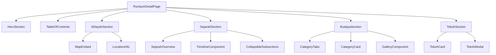

# Design Document: Rumpun Detail Enhancement

## Overview

Fitur ini meningkatkan halaman detail rumpun Batak (`/sejarah/[slug]`) dengan konten yang lebih kaya dan interaktif. Peningkatan meliputi peta interaktif untuk wilayah, konten sejarah terstruktur dengan timeline, budaya dan tradisi dengan kategori, serta tokoh penting dengan informasi lengkap.

## Architecture

### Enhanced Page Structure

```
/sejarah/[slug]
├── Hero Section (existing, enhanced)
├── Table of Contents (sticky sidebar)
├── Wilayah Section
│   ├── Map Component (Google Maps embed)
│   ├── Location Description
│   └── Kabupaten/Landmarks List
├── Sejarah Section
│   ├── Overview
│   ├── Timeline Component
│   └── Sub-sections (Asal Usul, Kerajaan, Perlawanan, Era Modern)
├── Budaya Section
│   ├── Tab/Accordion Navigation
│   ├── Category Cards (Kekerabatan, Musik, Pakaian, Rumah, Upacara)
│   └── Gallery Component
└── Tokoh Section
    └── Enhanced Tokoh Cards (with photo, bio, achievements)
```

### Component Architecture



## Components and Interfaces

### MapEmbed Component

Komponen untuk menampilkan peta interaktif menggunakan Google Maps embed.

```typescript
interface MapEmbedProps {
  latitude: number;
  longitude: number;
  zoom?: number;
  markers?: MapMarker[];
  fallbackImage?: string;
  title: string;
}

interface MapMarker {
  lat: number;
  lng: number;
  label: string;
  type: 'kabupaten' | 'landmark' | 'center';
}
```

Features:
- Google Maps iframe embed (no API key required for basic embed)
- Fallback static image jika embed gagal
- Responsive container dengan aspect ratio 16:9
- Loading state dengan skeleton

### TimelineComponent

Komponen untuk menampilkan timeline sejarah secara visual.

```typescript
interface TimelineProps {
  events: TimelineEvent[];
}

interface TimelineEvent {
  year: number | string;
  title: string;
  description: string;
  image?: string;
}
```

Features:
- Vertical timeline dengan alternating layout
- Animated entry on scroll
- Year badge dengan accent color
- Optional image per event

### CategoryTabs Component

Komponen tab navigation untuk kategori budaya.

```typescript
interface CategoryTabsProps {
  categories: BudayaCategory[];
  activeCategory: string;
  onCategoryChange: (categoryId: string) => void;
}

interface BudayaCategory {
  id: string;
  title: string;
  icon: string;
  content: string;
  images?: string[];
}
```

Features:
- Horizontal scrollable tabs on mobile
- Icon + label untuk setiap tab
- Smooth transition antar kategori
- Active state dengan accent color

### TokohCard Component (Enhanced)

Komponen kartu tokoh dengan informasi lengkap.

```typescript
interface TokohCardProps {
  tokoh: EnhancedTokoh;
  onExpand?: () => void;
}

interface EnhancedTokoh {
  nama: string;
  gelar: string;
  foto?: string;
  tahunLahir?: number;
  tahunWafat?: number;
  bidang: string;
  ringkasan: string;
  biografi: string;
  pencapaian: string[];
}
```

Features:
- Avatar/foto dengan fallback placeholder
- Periode hidup (tahun lahir - wafat)
- Expandable biography
- Achievement badges/list
- Hover animation

### TableOfContents Component

Komponen navigasi sticky untuk section.

```typescript
interface TableOfContentsProps {
  sections: TOCSection[];
  activeSection: string;
}

interface TOCSection {
  id: string;
  title: string;
  icon?: string;
}
```

Features:
- Sticky positioning on desktop
- Smooth scroll to section
- Active section highlighting
- Hidden on mobile (hamburger menu alternative)

## Data Models

### Enhanced RumpunBatak Type

```typescript
interface RumpunBatakEnhanced {
  id: string;
  nama: string;
  slug: string;
  deskripsi: string;
  gambar: string;
  
  // Enhanced Wilayah
  wilayah: {
    nama: string;
    deskripsi: string;
    koordinat: {
      latitude: number;
      longitude: number;
    };
    kabupaten: string[];
    landmarks: {
      nama: string;
      latitude: number;
      longitude: number;
      deskripsi?: string;
    }[];
  };
  
  // Enhanced Sejarah
  sejarah: {
    ringkasan: string;
    asalUsul: string;
    kerajaan?: string;
    perlawananKolonial?: string;
    eraModern?: string;
    timeline: TimelineEvent[];
    images?: {
      src: string;
      alt: string;
      caption: string;
    }[];
  };
  
  // Enhanced Budaya
  budaya: {
    ringkasan: string;
    sistemKekerabatan: {
      deskripsi: string;
      struktur?: string[];
    };
    musikTarian: {
      deskripsi: string;
      jenis?: string[];
    };
    pakaian: {
      deskripsi: string;
      jenis?: string[];
    };
    rumahAdat: {
      deskripsi: string;
      jenis?: string[];
    };
    upacaraAdat: {
      deskripsi: string;
      jenis?: string[];
    };
    gallery?: {
      src: string;
      alt: string;
      category: string;
    }[];
  };
  
  // Enhanced Tokoh
  tokoh: EnhancedTokoh[];
}

interface TimelineEvent {
  year: number | string;
  title: string;
  description: string;
  image?: string;
}

interface EnhancedTokoh {
  nama: string;
  gelar: string;
  foto?: string;
  tahunLahir?: number;
  tahunWafat?: number;
  bidang: string;
  ringkasan: string;
  biografi: string;
  pencapaian: string[];
}
```

### Backward Compatibility

Untuk menjaga backward compatibility, sistem akan:
1. Memeriksa apakah data menggunakan format baru atau lama
2. Jika format lama, konversi otomatis ke format baru dengan default values
3. Komponen akan handle missing fields dengan graceful fallbacks

```typescript
function normalizeRumpunData(data: any): RumpunBatakEnhanced {
  // Convert old format to new format
  if (typeof data.wilayah === 'string') {
    return {
      ...data,
      wilayah: {
        nama: data.wilayah,
        deskripsi: data.wilayah,
        koordinat: getDefaultCoordinates(data.slug),
        kabupaten: [],
        landmarks: []
      },
      sejarah: {
        ringkasan: data.sejarah,
        asalUsul: data.sejarah,
        timeline: []
      },
      budaya: {
        ringkasan: data.budaya,
        sistemKekerabatan: { deskripsi: '' },
        musikTarian: { deskripsi: '' },
        pakaian: { deskripsi: '' },
        rumahAdat: { deskripsi: '' },
        upacaraAdat: { deskripsi: '' }
      },
      tokoh: data.tokoh.map(normalizeTokhData)
    };
  }
  return data;
}
```

## Correctness Properties

*A property is a characteristic or behavior that should hold true across all valid executions of a system-essentially, a formal statement about what the system should do. Properties serve as the bridge between human-readable specifications and machine-verifiable correctness guarantees.*

### Property 1: Data Schema Validity

*For any* rumpun data object in the enhanced format, it SHALL contain all required fields: wilayah object with koordinat, sejarah object with ringkasan, budaya object with category fields, and tokoh array with enhanced fields.

**Validates: Requirements 5.1, 5.2, 5.3, 5.4**

### Property 2: Map Component Data Binding

*For any* rumpun with wilayah.koordinat data, the MapEmbed component SHALL receive valid latitude and longitude values within valid ranges (-90 to 90 for lat, -180 to 180 for lng).

**Validates: Requirements 1.1, 1.3**

### Property 3: Timeline Chronological Order

*For any* sejarah.timeline array with multiple events, the rendered timeline SHALL display events sorted in chronological order by year.

**Validates: Requirements 2.2, 2.3**

### Property 4: Sejarah Section Structure

*For any* rumpun with sejarah data, the rendered Section_Sejarah SHALL contain the ringkasan and at least one sub-section (asalUsul, kerajaan, perlawananKolonial, or eraModern).

**Validates: Requirements 2.1**

### Property 5: Budaya Category Completeness

*For any* rumpun with budaya data, the rendered Section_Budaya SHALL display all non-empty categories with their title and description.

**Validates: Requirements 3.1, 3.2**

### Property 6: Tokoh Card Completeness

*For any* tokoh in the tokoh array, the rendered TokohCard SHALL display nama, gelar, and either foto or placeholder avatar.

**Validates: Requirements 4.1, 4.2**

### Property 7: Backward Compatibility

*For any* rumpun data in the old format (wilayah as string), the normalizeRumpunData function SHALL produce a valid enhanced format object without data loss.

**Validates: Requirements 5.5**

## Error Handling

### Map Loading Errors

- Jika Google Maps embed gagal load (network error, blocked), tampilkan fallback static image
- Fallback image menunjukkan peta statis dengan marker lokasi
- Tetap tampilkan deskripsi wilayah dan daftar kabupaten

### Missing Data Handling

- Jika sejarah.timeline kosong, sembunyikan TimelineComponent
- Jika budaya category kosong, tampilkan placeholder "Informasi akan segera ditambahkan"
- Jika tokoh.foto tidak ada, gunakan placeholder avatar dengan inisial nama

### Image Loading Errors

- Gunakan Next.js Image dengan onError handler
- Fallback ke placeholder image yang sesuai kategori
- Log error untuk monitoring

## Testing Strategy

### Unit Tests

Unit tests akan fokus pada:
- Data normalization function (old to new format conversion)
- Component rendering dengan berbagai props
- Edge cases (empty arrays, missing fields)

### Property-Based Tests

Property-based tests menggunakan `fast-check` library untuk:
- Validasi schema data rumpun enhanced
- Validasi timeline sorting
- Validasi coordinate ranges
- Validasi backward compatibility conversion

Konfigurasi:
- Minimum 100 iterations per property test
- Tag format: **Feature: rumpun-detail-enhancement, Property {number}: {property_text}**

### Integration Tests

- Page rendering dengan real enhanced data
- Map embed loading dan fallback
- Tab navigation dalam budaya section
- Tokoh card expand/collapse functionality

