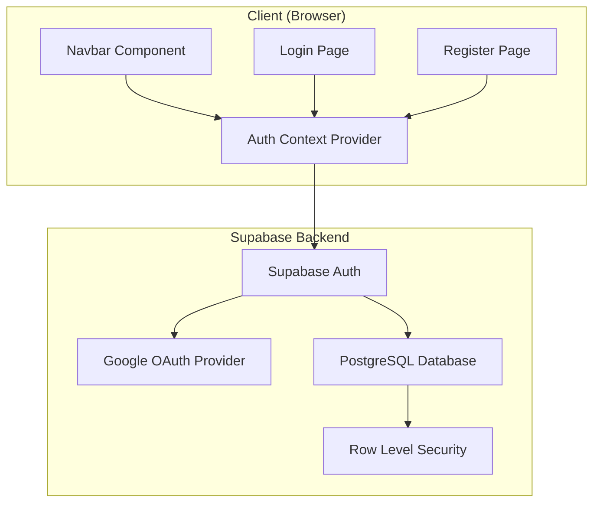

# Design Document: Supabase Authentication

## Overview

Sistem autentikasi untuk InfoBatak.id menggunakan Supabase Auth dengan Google OAuth sebagai satu-satunya metode login. Implementasi ini memanfaatkan `@supabase/ssr` untuk integrasi dengan Next.js App Router, dengan fokus pada kesederhanaan dan keamanan apply Row Level Security (RLS) di database.

Karena website ini menggunakan static export (`output: 'export'`), autentikasi akan berjalan sepenuhnya di client-side menggunakan Supabase JavaScript client.

## Architecture



## Components and Interfaces

### 1. Supabase Client (`lib/supabase.ts`)

```typescript
// Client-side Supabase client untuk static export
import { createClient } from '@supabase/supabase-js';

const supabaseUrl = process.env.NEXT_PUBLIC_SUPABASE_URL!;
const supabaseAnonKey = process.env.NEXT_PUBLIC_SUPABASE_ANON_KEY!;

export const supabase = createClient(supabaseUrl, supabaseAnonKey);
```

### 2. Auth Context Provider (`components/AuthProvider.tsx`)

```typescript
interface AuthContextType {
  user: User | null;
  loading: boolean;
  signInWithGoogle: () => Promise<void>;
  signOut: () => Promise<void>;
}
```

Responsibilities:

- Manage authentication state globally
- Provide auth methods to child components
- Listen to auth state changes via `onAuthStateChange`
- Handle OAuth redirect callbacks

### 3. Updated Navbar Component

Modifications to existing `components/layout/Navbar.tsx`:

- Add auth button section (desktop & mobile)
- Show "Daftar/Masuk" button when not authenticated
- Show user avatar/profile dropdown when authenticated
- Include logout option in dropdown

### 4. Login Page (`app/login/page.tsx`)

Simple page with:

- "Masuk dengan Google" button
- Link to register page
- Error message display area
- Redirect to homepage on successful login

### 5. Register Page (`app/register/page.tsx`)

Simple page with:

- "Daftar dengan Google" button (same OAuth flow)
- Link to login page
- Info text explaining Google OAuth registration

## Data Models

### User Profile Table (Supabase)

```sql
-- profiles table extends auth.users
CREATE TABLE public.profiles (
  id UUID REFERENCES auth.users(id) ON DELETE CASCADE PRIMARY KEY,
  email TEXT NOT NULL,
  display_name TEXT,
  avatar_url TEXT,
  created_at TIMESTAMPTZ DEFAULT NOW() NOT NULL,
  updated_at TIMESTAMPTZ DEFAULT NOW() NOT NULL
);

-- Enable RLS
ALTER TABLE public.profiles ENABLE ROW LEVEL SECURITY;

-- Users can read their own profile
CREATE POLICY "Users can view own profile" ON public.profiles
  FOR SELECT USING (auth.uid() = id);

-- Users can update their own profile
CREATE POLICY "Users can update own profile" ON public.profiles
  FOR UPDATE USING (auth.uid() = id);

-- Trigger to create profile on user signup
CREATE OR REPLACE FUNCTION public.handle_new_user()
RETURNS TRIGGER AS $$
BEGIN
  INSERT INTO public.profiles (id, email, display_name, avatar_url)
  VALUES (
    NEW.id,
    NEW.email,
    NEW.raw_user_meta_data->>'full_name',
    NEW.raw_user_meta_data->>'avatar_url'
  );
  RETURN NEW;
END;
$$ LANGUAGE plpgsql SECURITY DEFINER;

CREATE TRIGGER on_auth_user_created
  AFTER INSERT ON auth.users
  FOR EACH ROW EXECUTE FUNCTION public.handle_new_user();
```

### TypeScript Types (`types/index.ts`)

```typescript
export interface UserProfile {
  id: string;
  email: string;
  display_name: string | null;
  avatar_url: string | null;
  created_at: string;
  updated_at: string;
}

export interface AuthState {
  user: UserProfile | null;
  loading: boolean;
  error: string | null;
}
```

## Correctness Properties

_A property is a characteristic or behavior that should hold true across all valid executions of a system-essentially, a formal statement about what the system should do. Properties serve as the bridge between human-readable specifications and machine-verifiable correctness guarantees._

### Property 1: Navbar reflects authentication state

_For any_ authentication state (authenticated or not), the navbar SHALL display the appropriate UI element - "Daftar/Masuk" button when not authenticated, or user profile/avatar when authenticated.

**Validates: Requirements 1.3, 5.3**

### Property 2: OAuth error handling

_For any_ OAuth authentication error returned by Supabase, the Auth System SHALL display a user-friendly error message that describes the issue.

**Validates: Requirements 2.4**

### Property 3: Session establishment on OAuth success

_For any_ successful Google OAuth authentication, the Auth System SHALL establish a valid session with the user's information accessible via the auth context.

**Validates: Requirements 2.3**

### Property 4: Complete user data storage

_For any_ new user authenticated via Google OAuth, the profiles table SHALL contain a record with id, email, display_name, avatar_url, created_at, and updated_at fields.

**Validates: Requirements 3.1, 3.2**

### Property 5: Session termination on logout

_For any_ logout action by an authenticated user, the Auth System SHALL clear the session and the user SHALL no longer be accessible via the auth context.

**Validates: Requirements 5.1**

### Property 6: Environment variable validation

_For any_ missing required environment variable (NEXT_PUBLIC_SUPABASE_URL or NEXT_PUBLIC_SUPABASE_ANON_KEY), the Auth System SHALL throw an error with a message identifying the missing variable.

**Validates: Requirements 4.3**

## Error Handling

### OAuth Errors

| Error Type        | User Message                                            | Action                         |
| ----------------- | ------------------------------------------------------- | ------------------------------ |
| `access_denied`   | "Akses ditolak. Silakan coba lagi."                     | Show error, stay on login page |
| `invalid_request` | "Permintaan tidak valid. Silakan refresh halaman."      | Show error, stay on login page |
| `server_error`    | "Terjadi kesalahan server. Silakan coba lagi nanti."    | Show error, stay on login page |
| Network error     | "Tidak dapat terhubung. Periksa koneksi internet Anda." | Show error, stay on login page |

### Session Errors

| Error Type      | User Message                                       | Action                           |
| --------------- | -------------------------------------------------- | -------------------------------- |
| Session expired | "Sesi Anda telah berakhir. Silakan masuk kembali." | Redirect to login                |
| Invalid session | "Sesi tidak valid. Silakan masuk kembali."         | Clear session, redirect to login |

## Testing Strategy

### Unit Testing

Unit tests will be written using Vitest to verify:

- AuthProvider correctly manages state
- Navbar renders correct UI based on auth state
- Login/Register pages render correctly
- Error messages display appropriately

### Property-Based Testing

Property-based tests will be written using `fast-check` library to verify:

- Navbar state consistency with auth state (Property 1)
- Error message generation for various OAuth errors (Property 2)
- Session state after authentication (Property 3)
- User data completeness (Property 4)
- Session clearing on logout (Property 5)
- Environment variable validation (Property 6)

Each property-based test MUST:

- Run a minimum of 100 iterations
- Be tagged with format: `**Feature: supabase-auth, Property {number}: {property_text}**`
- Reference the correctness property it implements

### Integration Testing

Manual testing checklist:

- [ ] Google OAuth flow completes successfully
- [ ] User profile is created in database
- [ ] Navbar updates after login/logout
- [ ] Session persists across page refreshes
- [ ] Logout clears session completely

## Environment Setup Documentation

### Required Environment Variables

Create `.env.local` file:

```bash
NEXT_PUBLIC_SUPABASE_URL=your_supabase_project_url
NEXT_PUBLIC_SUPABASE_ANON_KEY=your_supabase_anon_key
```

### Supabase Dashboard Configuration

1. **Enable Google OAuth Provider:**
   - Go to Authentication > Providers
   - Enable Google
   - Add Google Client ID and Secret from Google Cloud Console

2. **Configure Redirect URLs:**
   - Add `http://localhost:3000` for development
   - Add production URL when deploying

3. **Run SQL for profiles table:**
   - Go to SQL Editor
   - Run the SQL from Data Models section

### Google Cloud Console Setup

1. Create OAuth 2.0 credentials
2. Add authorized redirect URI: `https://<your-project>.supabase.co/auth/v1/callback`
3. Copy Client ID and Secret to Supabase dashboard
